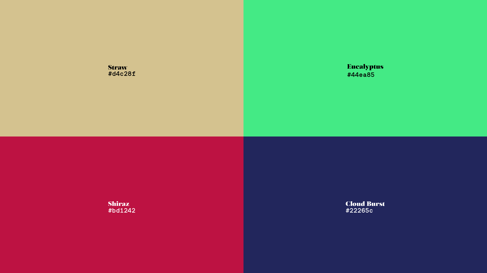

# ColorPaper - Uniform color wallpapers

This script generates uniform wallpapers, displaying the color's name and hex code (in case it's good and you want to write it down). Its intended use is for a carousel wallpaper, changing regularly.

> Je suis un bandeur de couleurs. ("I'm a color lover")

Example wallpapers generated:


## Installation

Just in case, this is for Linux: may be different on your OS

```bash
# Clone the repo
git clone git@github.com:FumedSaumonSauvage/ColorPaper.git

# Navigate to the project directory
cd ColorPaper

# Optional: create a venv
python -m venv .venv
source .venv/bin/activate

#Install dependencies
pip install requests pillow
```

## Usage

Modify the number of images you want and their size in main, then run the script to generate wallpapers.

## KDE special

If you are on KDE, use the `wp_manager.sh` to automatically delete the wp you don't like, or copy the ones you like to a curated folder.
Usage:

```bash
$ wp_manager.sh good # Copies the wallpaper to a curated directory
$ wp_manager.sh bad # Deletes the wallpaper
```
Use aliases to access this script a little faster.


## Credits & Licence

- Salomé and Nudica Mono fonts from [Atipo Studio](https://www.atipofoundry.com/)
- Color names by [The Color API](https://www.thecolorapi.com/)

Licence: WTFPL
